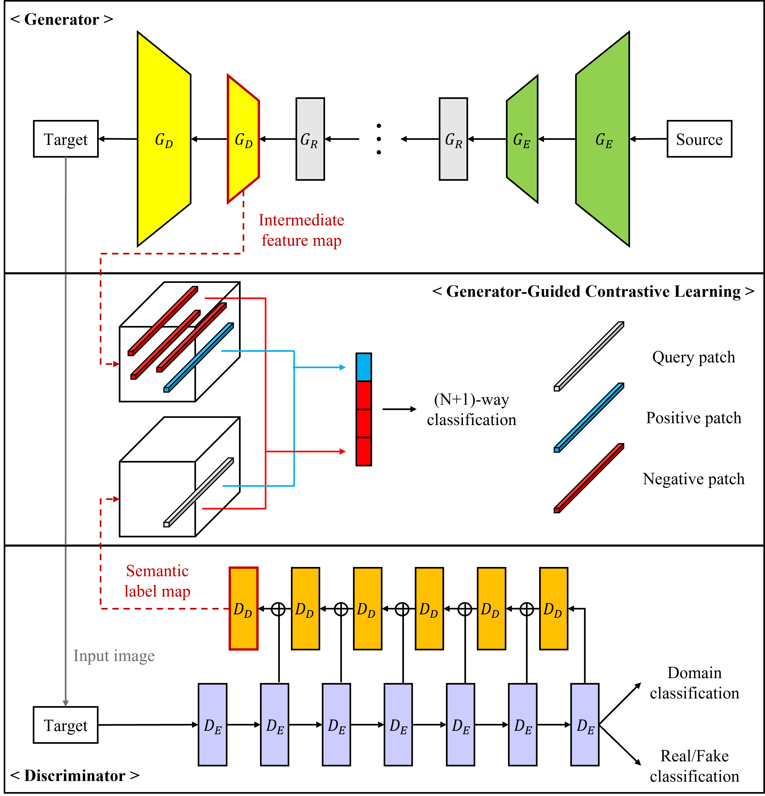

<h1 align="center"> CT Kernel Conversion Using Multi-Domain Image-to-Image Translation with Generator-Guided Contrastive Learning </h1>
<div align="center">
  <a>Changyong&nbsp;Choi</a><sup>1,2,†</sup> &ensp; <b>&middot;</b> &ensp;
  <a href="https://github.com/JeongJiHeon" target="_blank">Jiheon&nbsp;Jeong</a><sup>1,2,†</sup> &ensp; <b>&middot;</b> &ensp;
  <a>Sangyoon&nbsp;Lee</a><sup>2</sup> &ensp; <b>&middot;</b> &ensp;
  <a>Sang&nbsp;Min&nbsp;Lee</a><sup>3</sup> &ensp; <b>&middot;</b> &ensp;
  <a href="https://scholar.google.com/citations?hl=ko&user=e93LeuwAAAAJ" target="_blank">Namkug&nbsp;Kim</a><sup>2,3</sup> <br><br>
  <sup>1</sup>Department of Biomedical Engineering, AMIST, Asan Medical Center, University of Ulsan College of Medicine <br>
  <sup>2</sup>Department of Convergence Medicine, Asan Medical Center, University of Ulsan College of Medicine <br>
  <sup>3</sup>Department of Radiology, Asan Medical Center, University of Ulsan College of Medicine <br>
  †equal contribution <br>
</div>

## Introduction

This is an application study for CT kernel conversion using Multi-Domain Image-to-Image Translation ([StarGAN](https://github.com/yunjey/stargan)) with generator-guided discriminator regularization ([GGDR](https://github.com/naver-ai/GGDR)) and contrastive learning from contrastive unpaired translation ([CUT](https://github.com/taesungp/contrastive-unpaired-translation)).

In our study, we used only SIEMENS dataset, however, you can train with other CT modalities from different manufacturer's vendor (e.g., GE, Philips). If you want to measure the metrics like PSNR and SSIM, you need registered ground truth CT images with the same participants.

<div align="center">
    
</div>

> **Abstract.** Computed tomography (CT) image can be reconstructed by various types of kernels depending on what anatomical structure is evaluated. Also, even if the same anatomical structure is analyzed, the kernel being used differs depend-ing on whether it is qualitative or quantitative evaluation. Thus, CT images recon-structed with different kernels would be necessary for accurate diagnosis. How-ever, once CT image is reconstructed with a specific kernel, the CT raw data, si-nogram is usually removed because of its large capacity and limited storage. To solve this problem, many methods have been proposed by using deep learning approach using generative adversarial networks in image-to-image translation for kernel conversion. Nevertheless, it is still challenging task that translated image should maintain the anatomical structure of source image in medical domain. In this study, we propose CT kernel conversion method using multi-domain image-to-image translation with generator-guided contrastive learning. Our proposed method maintains the anatomical structure of the source image accurately and can be easily utilized into other multi-domain image-to-image translation methods with only changing the discriminator architecture and without adding any addi-tional networks. Experimental results show that our proposed method can trans-late CT images from sharp into soft kernels and from soft into sharp kernels compared to other image-to-image translation methods. 

## Dependencies

* CUDA 11.6
* Pytorch 1.10.0

Please install [Pytorch](https://pytorch.org/) for your own CUDA version.

Also, install the other packages in `requirements.txt` following:
```bash
pip install -r requirements.txt
```

### Prepare your own dataset

For example, you should set dataset path following:
```text
root_path
    ├── train
          ├── SIEMENS
                ├── B30f
                      ├── 0001.dcm
                      ├── 0002.dcm
                      └── 0003.dcm
                ├── B50f
                └── B70f
          └── GE
               ├── SOFT
               ├── CHEST
               └── EDGE
    ├── valid
    └── test
```


## Training

For multi-GPU, you can use `--multi-gpu-mode DataParallel`.

For generator-guided contrastive learning, you should specify two arguments below:

* `--use_feature` makes GGCL (or [GGDR](https://github.com/naver-ai/GGDR)) run.
* `--guide_type` decides which regularization method is used between GGDR and GGCL. Default is GGCL.

If not specified `--use_feature`, Vanilla [StarGAN](https://github.com/yunjey/stargan) will be run.

For one dataset (e.g. SIEMENS),
```python
python main.py --mode train --dataset SIEMENS --batch_size 2 --root_path 'your_own_dataset_path' --use_feature --guide_type ggcl
```
for two dataset (e.g. SIEMENS and GE),
```python
python main.py --mode train --dataset Both --batch_size 2 --root_path 'your_own_dataset_path' --use_feature --guide_type ggcl
```

Model checkpoints and validation samples will be stored in `./result/models` and `./result/samples`, respectively.

### resume

To restart training, you can use `--resume_iters`.
```python
python main.py --mode train --dataset SIEMENS --batch_size 2 --root_path 'your_own_dataset_path' --use_feature --guide_type ggcl --resume_iters 100000
```


## Test

### Png file save
```python
# for one dataset
python main.py --mode test --dataset SIEMENS --batch_size 1 --root_path 'your_own_dataset_path' --save_path 'result' --use_feature --test_iters 400000

# for two dataset
python main.py --mode test --dataset Both --batch_size 1 --root_path 'your_own_dataset_path' --save_path 'result' --use_feature --test_iters 400000
```

Test results will be stored in `./result/results/png` as png file.

### Dicom file save

To save results as dicom file together, you can use `--dicom_save`.

*** *Caution* *** When using `--dicom_save`, you should set `--batch_size 1`.

```python
# for one dataset
python main.py --mode test --dataset SIEMENS --batch_size 1 --root_path 'your_own_dataset_path' --save_path 'result' --use_feature --test_iters 400000 --dicom_save

# for two dataset
python main.py --mode test --dataset Both --batch_size 1 --root_path 'your_own_dataset_path' --save_path 'result' --use_feature --test_iters 400000 --dicom_save
```

Test results will be stored in `./result/results/png` and `./result/results/dcm` as png file and dicom file, respectively.


## Acknowledgement

Our main code is heavily based on [StarGAN](https://github.com/yunjey/stargan) and patch-wise contrastive learning code is brought from [CUT](https://github.com/taesungp/contrastive-unpaired-translation).

`data_loader.py` is inspired by [StyleGAN2-ADA](https://github.com/NVlabs/stylegan2-ada-pytorch).
